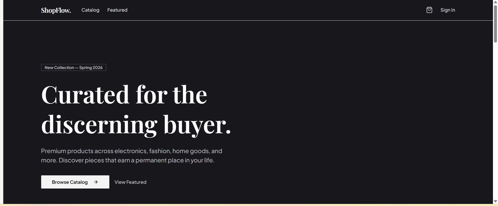
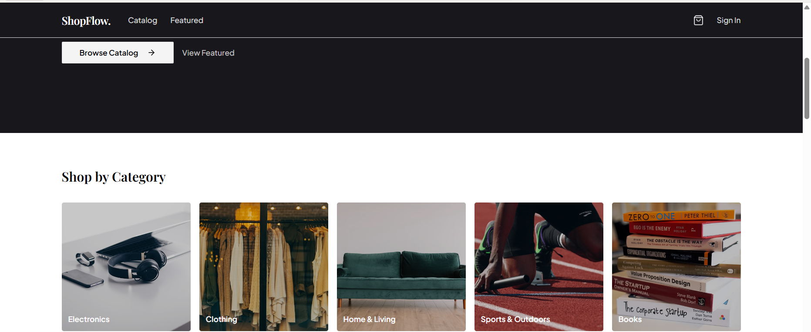
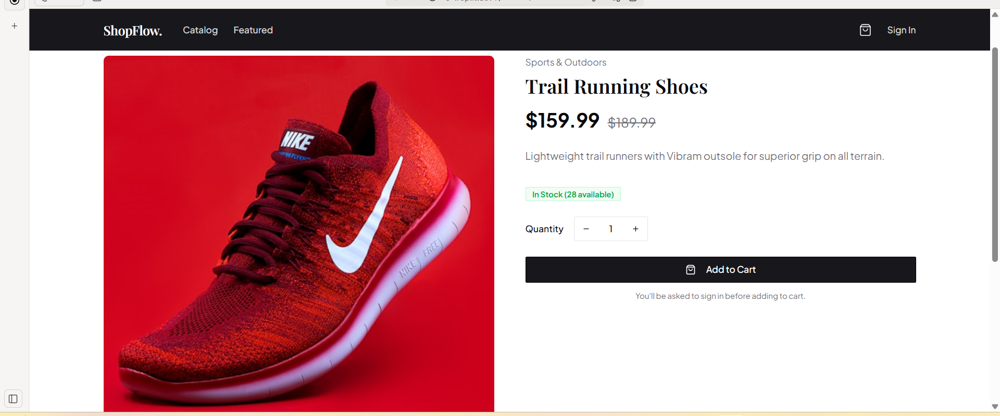
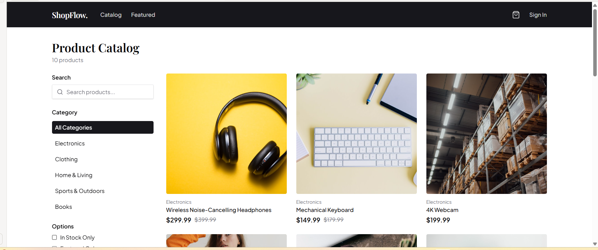
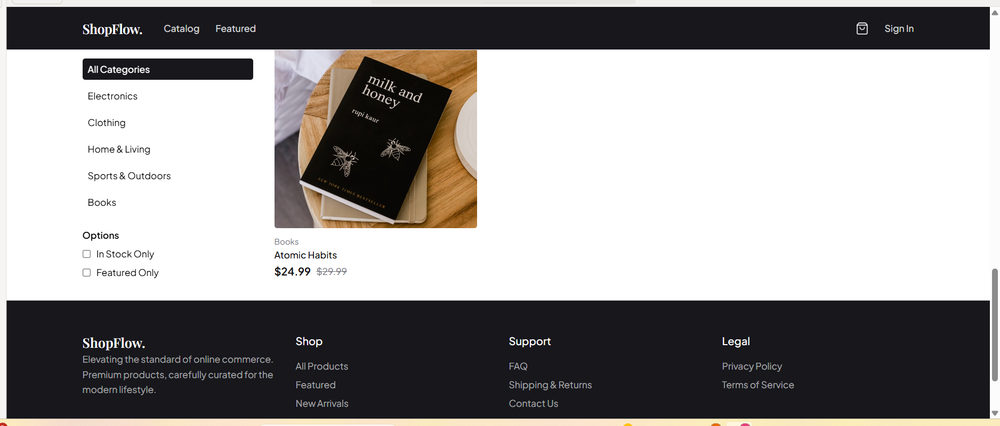

1. Project Title
   # 🛒 Basic E-Commerce Web Application

2. Description-- 
    A simple yet functional online store built.
    It allows users to browse products, add them to a shopping cart, place orders, and track their order status.
    Includes an admin panel for managing products, categories, and orders.

4. Features--
    Product Management – Add, edit, delete, and categorize products.
    Shopping Cart – Add/remove items, update quantities.
    Order Tracking – View order history and current status.
    User Authentication – Sign up, log in, and manage profiles.
    Responsive Design – Works on desktop and mobile.

## 📸 Screenshots

### 🏠 Home Page

### 🛍️ Product Listing

### 🛒 Shopping Cart

   

   
